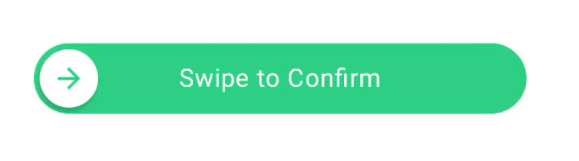
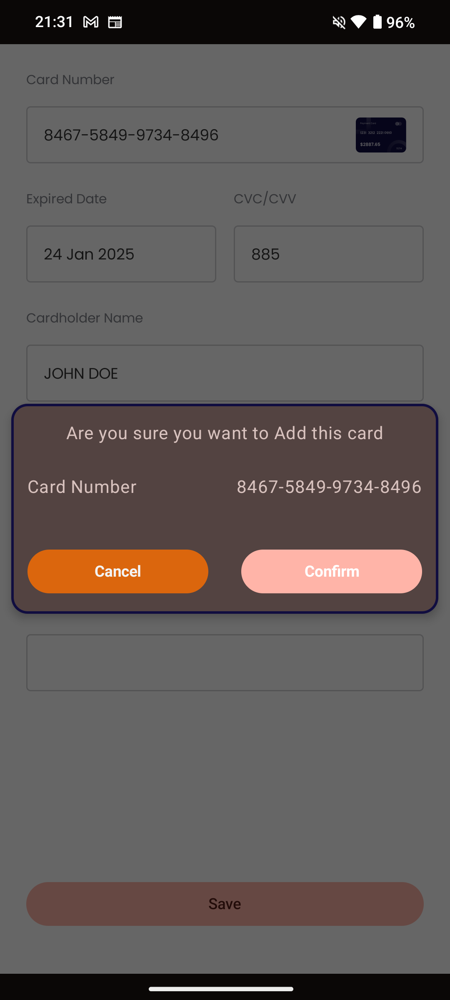
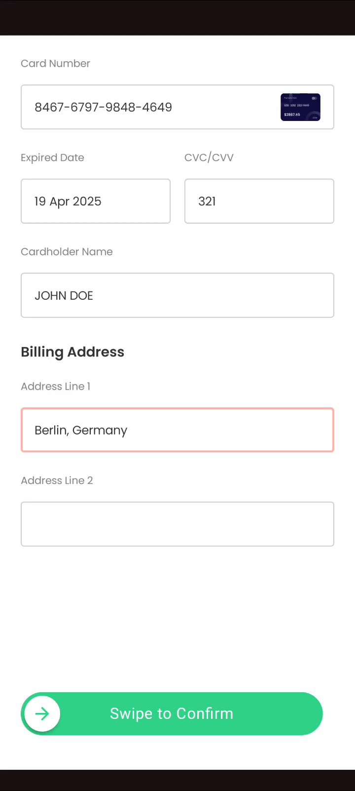
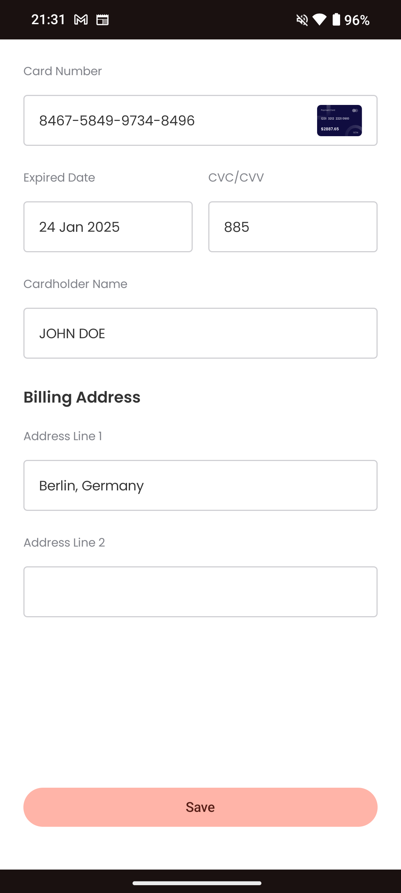

# Slide-to-Confirm---Interactive-System-Project

# Interactive Systems

Sakib, Md Nazmos  
Siam, Md Hossain Mahmud  
  
Winterterm 2024/25  
Schmalkalden University of Applied Sciences  

# Introduction

### Problem Statement
Two-factor confirmation is an important feature in every application. It solves some of the most important issues on the user end.  
some key points are: 
- > Preventing Accidental Actions.  
- > Moment of Doubt
   - > e.g Deleting some item or Bank transfer  

It gives user the ability to correct input items before committing the action permanently.   
### Use cases
- Financing Transaction
- Authentication/Safety
- Irreversible Action
 - e.g deleting an account or data
- Preventing Unintended Action
- Submitting a Form

# State of the art
<table>
  <tr>
    <th>Variant A</th>
    <th>Variant B</th>
  </tr> 
  <tr>
    <th>Slide to confirm</th>
    <th>Pop-up alert dialog box</th>
  </tr> 
  <tr>
    <th>
      4 possible action: Drag, Release, Cancel, Confirm
    </th>
    <th>2 possible action: Cancel, Confirm</th>
  </tr> 
  <tr>
    <td></td>
    <td></td>
  </tr>
</table>

# Proposal
- ***Postulation***: Users may prefer variant B because it’s more tactile and engaging. It creates a sense of satisfaction, although variant A will be faster and users may already familiar with this.

# Hypothesis
• ***H1:*** With variant B users will perform faster than variant A   
• ***H2:*** Users may be more engaging with variant A over B  
• ***H3:*** Variant B may be more familiar to the user than variant A

# Variables
### Independent variables
• ***Design:*** Variant A and B differ in layout and color.  
• ***Interaction:*** The interaction differs between single touch to sliding the interacting component.  
### Dependent variables 
• Speed.  
• User satisfaction.  

# Project Sample
### Variant A
    

### Variant B
<table>
<tr>
    <td></td>
    <td></td>
</tr>
</table>

# Evaluation
• 2 × 2 design.  
• Android Application for both variant.  
• In total 10 users will perform a in-between/within subject test   
• NSA-TLX as post-hoc test.  

  
